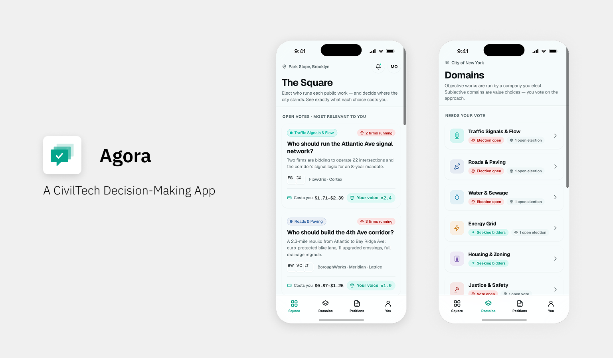

# Agora

**Your county/city. Your choice. Your vote.**

Agora is an open-source concept for a civic governance platform where citizens directly elect the companies and organizations that run their public services — roads, transit, utilities, healthcare, education, and more. It replaces opaque government procurement with a transparent, citizen-driven decision system.

This repository is not a product to be deployed or imposed on any government. It is a public square for an idea: a demonstrable, buildable alternative that anyone can study, fork, criticize, or bring to life.

## 🚀 Live Demo
[Try it here](https://arianrad.github.io/agora/)

---

## Why Agora Exists

Most people experience government as something that happens *to* them. A road gets rebuilt by a contractor they never heard of, chosen through a process they never saw, at a price they never approved. When the work is bad, there is no one to hold accountable and no memory of who decided.

Agora starts from a different assumption:

> **The people who live with the consequences of a decision should have real power over that decision.**

Not power in the abstract — voting once every four years for a party that then makes ten thousand procurement choices on your behalf — but concrete, granular power over the specific services that shape daily life. Who maintains your streets. Who runs your water. Who manages your city's traffic.

The name comes from the ancient Greek *agora*: the public square where civic, commercial, and social life met in the open. Agora tries to rebuild that square digitally — a place where proposals are visible, competition is public, and mandates come from citizens rather than closed committees.

### The three failures we're designing against

1. **Opacity.** Procurement happens behind doors. Agora makes every proposal, budget, and timeline public before a single vote is cast.
2. **Powerlessness.** Citizens can complain but not choose. Agora makes choosing the default mechanism.
3. **Amnesia.** Nobody remembers who promised what. Agora keeps a permanent, public accountability record tied to every elected provider.

---

## The Philosophy of Empowerment

### Decisions belong to the affected

Agora's core design principle is *proximity*: your voice counts most where your life actually happens. A person who lives in a neighborhood, works in it, and understands its problems has a legitimate, stronger claim to shaping it than someone with no connection to it. This is not exclusion — it is relevance.

### Competence is a signal, not a gate

Everyone can vote on everything within their region. But Agora acknowledges that a civil engineer voting on infrastructure, or a teacher voting on education services, brings knowledge worth weighting. Expertise amplifies a vote; it never replaces anyone else's.

### Companies serve, citizens decide

Providers do not lobby officials — they campaign to citizens, in public, in plain language. They state what they will build, what it will cost, and how long it will take. Winning is not a favor granted; it is a mandate earned. And a mandate can be revoked.

### Legitimacy requires participation

A provider "winning" with 3% turnout is not a mandate. Election results only become binding above minimum participation thresholds. Low turnout is treated as a failure of the process, not a loophole to exploit.

---

## How the Electoral Vote Works

Agora uses a **weighted electoral vote**. Every verified citizen gets a base vote, which is then adjusted by multipliers reflecting their real connection and relevant knowledge to the decision at hand.

### 1. Identity and profile

Citizens authenticate via OAuth with verified identity. Their electoral profile is built from four factors:

| Factor                 | What it captures             | Role                                                         |
| ---------------------- | ---------------------------- | ------------------------------------------------------------ |
| **Home location**      | Where the citizen lives      | Primary geographic weight — you are most affected where you live |
| **Work location**      | Where the citizen works      | Secondary geographic weight — you also have a stake where you spend your days |
| **Education level**    | Verified education           | Knowledge multiplier                                         |
| **Professional field** | The citizen's domain of work | Relevance multiplier when the vote falls in their field      |

### 2. Electoral weight per election

Your vote weight is *contextual* — it is calculated per election, not fixed globally:

- Voting on a **transit project in your home district** → full geographic weight.
- Voting on a project in the **city where you work but don't live** → partial weight.
- A **civil engineer voting on an infrastructure election** → professional multiplier applies.
- The same engineer voting on a **healthcare provider election** → no professional bonus, standard weight.

The result: the citizens most affected and most informed carry the most weight in each specific decision — while every citizen still counts in every election they're eligible for.

### 3. Your dashboard sorts by *your* highest electoral weight

When you open Agora, elections are ranked by your electoral relevance — the decisions where your vote carries the most weight appear first. This is deliberate: it directs your attention to the choices that concern you most, and fights voter fatigue by not burying you in forty equally-ranked ballots.

### 4. Two types of elections

**Open competitions.** Multiple companies compete for the same service domain (e.g., managing a city's traffic systems). Each publishes its proposal: scope, budget, and timeline in years. The provider with the most weighted votes above the participation threshold wins the mandate.

**New initiative votes.** A company proposes a new project (e.g., building infrastructure across a city) and citizens vote yes/no on whether it receives the budget at all. Citizens are not just choosing *who* — they are choosing *whether*.

### 5. Petitions and referendum triggers

Any citizen can open a petition to change something — a service, a rule, an elected provider's mandate. When a petition crosses its signature threshold, it automatically triggers a binding referendum. No committee decides whether the people's question deserves an answer; the threshold does.

### 6. Accountability after the vote

Winning is the beginning, not the end. Every elected provider's promises — budget, timeline, milestones — become a public accountability record. Citizens track delivery against the campaign, and underperformance is visible ammunition for the next election or a recall petition.

---

## Service Domains

Elections are organized into non-overlapping service domains, including:

- **Infrastructure** — roads, bridges, public works
- **Utilities** — water, power, waste
- **Urban management** — traffic, transit, public space
- **Health & safety** — public health services, emergency systems
- **Education** — schools and learning infrastructure
- **Housing & planning** — zoning, development, public housing
- **Economy & welfare** — local economic and social programs

---

## Design Safeguards

Agora is designed around its three biggest failure modes:

- **Capture** — campaign spending caps and mandatory plain-language summaries prevent wealthy providers from buying elections with polish.
- **Voter fatigue** — relevance-sorted dashboards, clear election calendars, and smart defaults keep participation sustainable.
- **Fake legitimacy** — minimum turnout thresholds mean no result is binding without a real mandate.

---

## Project Status

Agora is a concept and design repository. Current artifacts include the system model, service domain taxonomy, and a full UI/UX specification for the citizen app and the company dashboard. Contributions, critiques, and forks are welcome — that is the point of the square.

## License

Open source. Use it, break it, build it better.